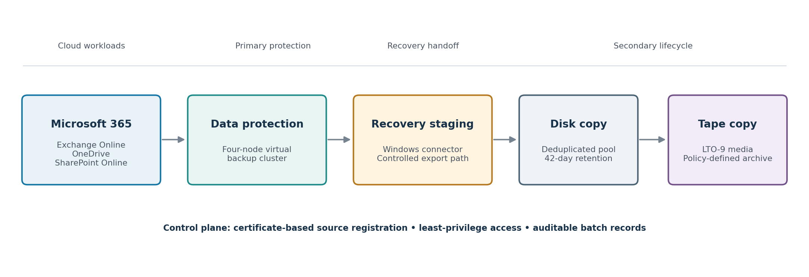
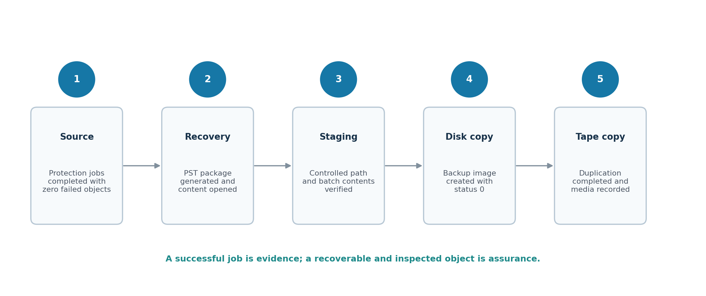

# Multi-Tier Microsoft 365 Backup Architecture

This repository accompanies the technical case study **“Design and Validation of a Multi-Tier Microsoft 365 Backup Architecture: On-Premises Recovery Staging, Deduplicated Disk Protection and LTO-9 Retention.”**

The paper describes a sanitized enterprise implementation that connected Microsoft 365 workloads to a four-node Cohesity DataProtect environment, a controlled Windows recovery connector, Veritas NetBackup MSDP, and an LTO-9 long-term retention tier.

## Architecture

The implemented flow was:

1. Microsoft 365 protection for Exchange Online, OneDrive, and SharePoint Online.
2. Application-aware recovery through a dedicated Windows connector.
3. Controlled export staging and content inspection.
4. Secondary protection to a deduplicated disk pool with 42-day retention.
5. Storage Lifecycle Policy duplication to LTO-9 for policy-defined long-term retention.

## Validation method

The proof of concept validated more than job completion. It checked protection status, generated an Exchange Online recovery package, opened PST content in Outlook, created an MSDP image, and verified the second copy on tape.

| Evidence | Result |
|---|---:|
| Protected test objects | 8 successful, 0 failed |
| Representative logical data | Approximately 16.7 GB |
| Files in the representative batch | 24 |
| Disk backup result | Status 0 |
| Tape duplication result | Status 0 |
| Observed tape-copy elapsed time | Approximately 5 min 34 sec |

These are implementation-test observations, not general product benchmarks.

## Paper

- [Publication PDF](paper/Multi_Tier_Microsoft_365_Backup_Case_Study_v1.0.pdf)
- [Editable Word version](paper/Multi_Tier_Microsoft_365_Backup_Case_Study_v1.0.docx)

## Important limitations

- A forced tape-only restore was not included in the original proof of concept.
- The strongest content-level restore evidence applies to Exchange Online/PST.
- Granular OneDrive and SharePoint recovery tests remain to be completed.
- Immutability was not enabled during the proof of concept.
- Formal RPO/RTO, cost, and full-scale performance studies were outside scope.

## Publication safety

This repository contains only the sanitized public edition. Organization names, tenant details, hostnames, IP addresses, application identifiers, accounts, user names, screenshots, job IDs, image IDs, media IDs, and access details are intentionally excluded.

Do not add the confidential internal implementation document or unredacted screenshots to this repository.

## Citation

Citation metadata is provided in [`CITATION.cff`](CITATION.cff). Cite the published report using [DOI 10.5281/zenodo.23133779](https://doi.org/10.5281/zenodo.23133779).

## Author

Sajid Sarwar — Independent Researcher, Kuwait  
[ORCID 0009-0002-2120-9631](https://orcid.org/0009-0002-2120-9631)  
Version 1.0.0 — 4 October 2026
